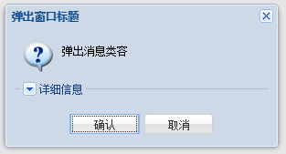
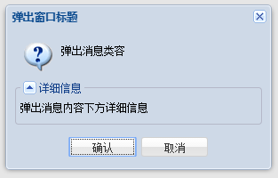

# Ext.ux.window.DetailMessageBox
带有可以折叠详细信息的对话框，该扩展组件是基于ExtJS5.1.1版本仿照MessageBox单例窗口编写。会有很多不完善的地方，将在以后的项目中或业余时间中进行修改。

## 部署扩展
将 `DetailMessageBox.js` 文件放于项目所在的 ExtJS 库目录
新建立 `ux/window` 即可

## 引入扩展
在对应的 `controller` 中使用 `requires` 将 `Ext.ux.window.DetailMessageBox` 类名引入：
```javascript

requires : [
  'Ext.ux.window.DetailMessageBox'
]

```

## 使用方法
该扩展定义的为单例窗口，在引入时就已实例化，所以在需要弹出详细对话框时可以直接使用别名 `Ext.ux.DetailMsg` 进行操作：

```javascript

Ext.ux.DetailMsg.show({
   title : '弹出窗口标题',
   icon : Ext.Msg.QUESTION,
   width : 300,
   msg : '弹出消息类容',
   bDetail : '弹出消息内容下方详细信息',
   buttons: Ext.Msg.OKCANCEL,
   fn : function(btnId){
       if (btnId === 'ok'){
           //点击了确认按钮
       }
   }
})

```
效果如下图：






## 配置项
* `title` — 窗口标题
* `icon` — 消息类型图标
	* 可以指定一个自定义的图标类名
	* 可以使用 ExtJS 内置图标
     *  Ext.MessageBox.INFO
     *  Ext.MessageBox.WARNING
     *  Ext.MessageBox.QUESTION
     *  Ext.MessageBox.ERROR
* `msg` — 简要消息文本
* `bDetail` — 占据下方全宽详细信息文本 `bDetail` 或 `sDetail` 任选一个使用即可
* `sDetail` — 图标右侧缩进详细信息文本 `bDetail` 或 `sDetail` 任选一个使用即可
* `buttons` — 窗口按钮组合
	* 可以使用 ExtJS 内置按钮组合
	 *  Ext.MessageBox.OK
     *  Ext.MessageBox.YES
     *  Ext.MessageBox.NO
     *  Ext.MessageBox.CANCEL
     *  Ext.MessageBox.OKCANCEL
     *  Ext.MessageBox.YESNO
     *  Ext.MessageBox.YESNOCANCEL
* `fn` — 窗口按钮回调
* `autoHide:true/false` — 默认 `true` 点击按钮后自动关闭本窗口；`false` 时按钮点击后不自动隐藏,需要使用 `Ext.ux.DetailMsg.hide()` 方法进行窗口隐藏操作。 窗口右上角的 `X` 按钮不在该配置控制范围

## 方法
* `show(config)` — *{config:Object}* 使用时传入配置项
* `hide()` — 当 `autoHide:false` 时使用该方法隐藏窗口
* `updateText(msg)` — *{msg:String}* 用于更改简要消息
* `updateDetailMsg(s/b, msg)` — *s*：用于更改sDetail框中的详细信息，*b*：用于更改bDetail框上的详细信息；*{msg:String}* 详细信息内容